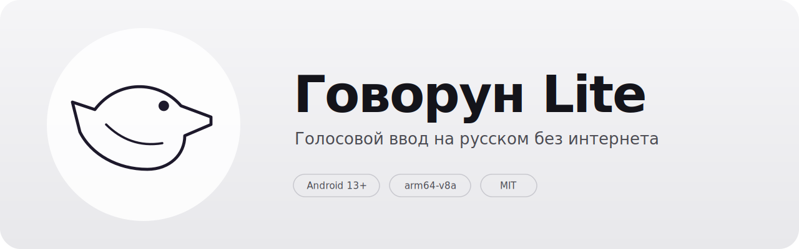

<p align="center">
  
</p>

# Говорун

Голосовой ввод на русском для Android. Работает прямо на телефоне — без
интернета, без аккаунтов, без облака. Звук никуда не отправляется.

Под капотом:

- **[GigaAM v3](https://github.com/salute-developers/GigaAM)** — модель распознавания речи от Сбера, лицензия MIT
- **[sherpa-onnx](https://github.com/k2-fsa/sherpa-onnx)** — нативный ONNX-рантайм
- **[Silero VAD](https://github.com/snakers4/silero-vad)** — офлайновый детектор речевой активности

## Установка

**Рекомендуемый способ — [RuStore](https://www.rustore.ru/catalog/app/com.govorun.lite).**
Магазин автоматически снимает предупреждение Play Protect «не проверено» и
даёт системе доверять приложению — никакие «ограниченные настройки» на
Android 13+ разблокировать не нужно, «Специальные возможности» включаются
сразу. Обновления приходят штатно.

Если RuStore недоступен — можно скачать подписанный APK из
[GitHub Releases](https://github.com/amidexe/govorun-lite/releases/latest).
Это сайдлоад: Android 13+ покажет предупреждение Play Protect, плюс
потребуется разблокировать «ограниченные настройки» для «Специальных
возможностей» — см. раздел [«Установка APK вручную»](#установка-собранного-apk-вручную) ниже. SHA-256 APK публикуется
в описании релиза — его стоит сверить перед установкой.

Либо собрать самостоятельно из исходников — см. раздел ниже.

## Как это работает

1. Включаете Говорун в настройках специальных возможностей.
2. Открываете любое поле ввода — сбоку появляется плавающий пузырь.
3. Два способа диктовать:
   - **Тап** — нажмите пузырь, говорите, нажмите ещё раз для остановки.
     Паузы в речи превращаются в абзацы. Подходит для длинной диктовки.
   - **Удержание** — зажмите пузырь, говорите, отпустите. Длинная фраза
     распознаётся целиком. Подходит для коротких реплик.
4. Распознанный текст вставляется туда, где курсор.

Ни клавиатуру менять, ни приложение открывать не надо — пузырь появляется
поверх любого поля в любой программе. Пузырь можно перетаскивать
вертикально пальцем; в Настройках есть размер, прозрачность и сторона
экрана.

## Технические детали

- Минимальная версия Android: 13 (API 33)
- Архитектура: `arm64-v8a`
- Модель GigaAM v3 — ~312 МБ, вшита в APK (размер релизного APK ~360 МБ)
- Silero VAD — 629 КБ, зашит в APK
- Разрешение `INTERNET` в манифесте **не заявлено** — сетевого стека у
  приложения нет; всё распознавание идёт на устройстве
- Пакет: `com.govorun.lite`

## Сборка из исходников

```bash
# Один раз — нативный рантайм sherpa-onnx (~47 МБ, в репо не лежит)
./scripts/download-sherpa-onnx.sh

# Один раз — ONNX-модель GigaAM v3 (~312 МБ, в репо не лежит; кладётся в app/src/main/assets/models/, затем вшивается в APK при сборке)
./scripts/download-model.sh

# Создать local.properties с путём к Android SDK
echo "sdk.dir=/path/to/android-sdk" > local.properties

./gradlew assembleDebug
adb install --user 0 -r app/build/outputs/apk/debug/app-debug.apk
```

## Установка собранного APK вручную

Если ставите APK в обход магазина (например, скачали готовый файл или
собрали сами и скинули на телефон), Android 13+ требует несколько
дополнительных шагов:

1. **Разрешить установку из неизвестных источников** для того приложения,
   из которого запускаете APK (браузер, файловый менеджер и т. п.).
   Настройки → Приложения → выбранное приложение → «Установка неизвестных
   приложений».

2. **Принять предупреждение Play Protect.** При первом запуске система
   может показать окно «Приложение не проверено». Нажмите «Всё равно
   установить» → «Установить».

3. **Разблокировать ограниченные настройки** (самый неочевидный шаг).
   Android 13+ по умолчанию блокирует Accessibility-сервис у сайдлоадных
   APK. Порядок действий:

   - Настройки → Специальные возможности → найдите Говорун в списке.
     Он будет там, но серым и неактивным — переключатель не нажимается.
   - Нажмите на саму строку с Говоруном. Всплывёт окно «Настройка
     недоступна в целях безопасности» с объяснением, что нужно
     разблокировать ограниченные настройки приложения.
   - Следуя подсказке из этого окна: Настройки → Приложения → Говорун →
     троеточие в правом верхнем углу → «Разрешить ограниченные
     настройки». Пункт троеточия появляется только после того, как
     система один раз показала вам это окно — иначе в меню его нет.
   - Вернитесь в Специальные возможности и включите Говорун.

Без этого шага переключатель так и останется серым. Через RuStore все
эти танцы не нужны — магазин автоматически получает доверие системы.

## Лицензия

Код приложения — MIT, см. [LICENSE](LICENSE).

Сторонние компоненты и их лицензии перечислены в
[THIRD_PARTY_LICENSES.txt](THIRD_PARTY_LICENSES.txt):

- **GigaAM v3** — модель Сбера, MIT
- **sherpa-onnx** — нативный рантайм, Apache 2.0
- **Silero VAD** — детектор речевой активности, MIT

Тот же файл доступен внутри приложения: «О программе» → «Лицензии».
